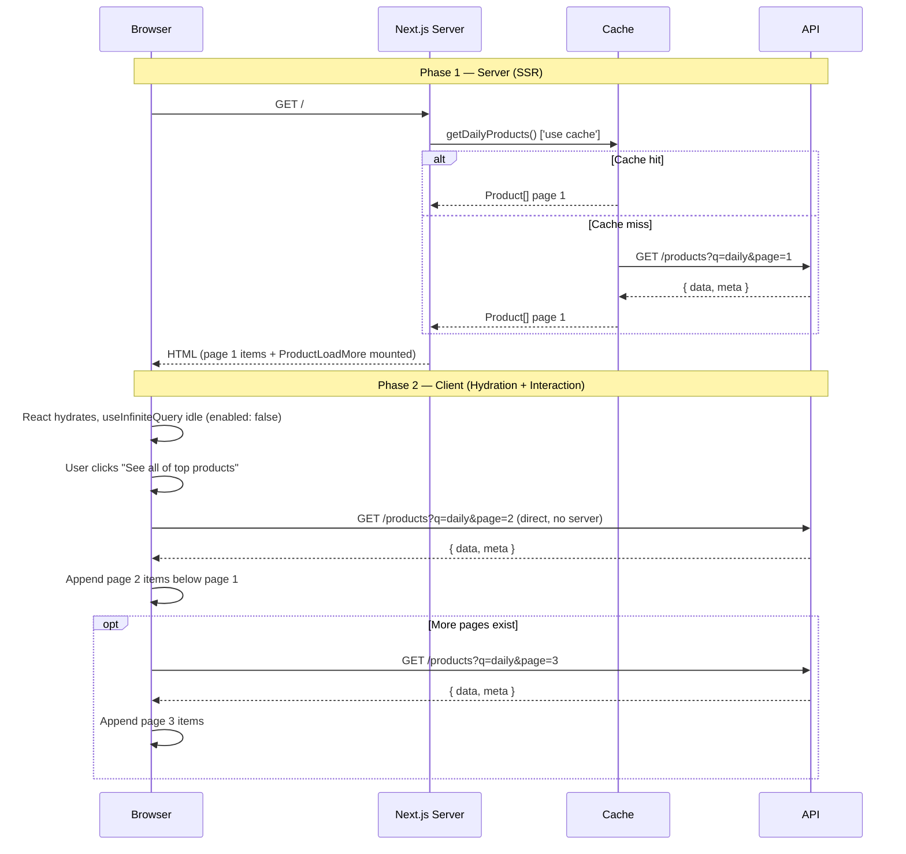

# Architecture Decisions — LaunchZap

> Engineering decisions made during development, including the context, trade-offs, and implementation approach for each.

**Highlights**
- 

---

## 1. Hybrid SSR + Client Pagination

### Decision
Server components render and cache the first page of each product feed. A client component (`ProductLoadMore`) owns all subsequent pages, fetching them directly from the API on user interaction.

### Context
The product feed is the core of the landing page. It needed to be SEO-indexed, fast on first paint, and still support dynamic pagination without a full page reload. A purely client-side approach would lose SSR. A purely server-side approach (full page reloads or server actions per page) would break the UX. The hybrid solves both.

### Flow



### Implementation
- `ProductFeedSection` — async server component, calls a cached fetcher, renders page 1, passes `endpoint` + `meta` as plain props to the client component
- `ProductLoadMore` — client component, `useInfiniteQuery` with `enabled: false` (no automatic fetch), `initialPageParam: 2`, accumulates pages in state
- The server component's `fetcher` returns `Pick<ProductListFullResponse, 'data' | 'meta'>` — reusing the existing schema type rather than defining a new one

### Trade-offs

| | |
|---|---|
| Page 1 is SSR, cached, SEO-indexed | Page 2+ are not indexed by crawlers |
| First paint is fast — no client JS needed | Requires the API to support pagination params |
| Cache can be invalidated independently per feed | `meta` being optional in the base schema requires a non-null assertion in the service |
| `useInfiniteQuery` handles page accumulation cleanly | Adds TanStack Query as a dependency |

---

## 2. Graduated Cache TTLs Per Feed Type

### Decision
Each product feed function carries its own `'use cache'` directive with a `cacheLife` TTL matched to how often that feed's data meaningfully changes.

```ts
export async function getDailyProducts() {
    'use cache'
    cacheLife('hours')       // revalidates every few hours
    return fetchProducts('/products?q=daily')
}

export async function getWeeklyProducts() {
    'use cache'
    cacheLife('days')        // revalidates once a day
    return fetchProducts('/products?q=weekly')
}

export async function getNewProducts() {
    'use cache'
    cacheLife('minutes')     // revalidates frequently
    return fetchProducts('/products?q=new')
}
```

### Context
A single global cache TTL would either over-cache "new arrivals" (stale data) or under-cache "top of the week" (wasted API calls). The TTL is a direct expression of expected mutation rate per feed.

### Trade-offs

| | |
|---|---|
| Each feed revalidates at the right frequency | More cache entries to manage and reason about |
| Reduces unnecessary API calls for stable feeds | A "weekly" feed showing a stale product for hours is technically correct but may feel wrong |
| `cacheLife` is declarative — no manual `revalidateTag` needed | Tied to Next.js cache infrastructure; harder to test in isolation |

---

## 3. Async Boundaries for Independent Streaming

### Decision
Each `ProductFeedSection` is individually wrapped in a `FeedAsyncBoundary` (Suspense boundary). Sections stream and resolve independently.

```tsx
<FeedAsyncBoundary>
    <ProductFeedSection fetcher={getDailyProducts} ... />
</FeedAsyncBoundary>
<FeedAsyncBoundary>
    <ProductFeedSection fetcher={getWeeklyProducts} ... />
</FeedAsyncBoundary>
```

### Context
Without boundaries, a slow database query for one feed would block the entire page from rendering. With per-section boundaries, each feed paints as soon as its data resolves — faster perceived load time even if total data fetch time is the same.

### Trade-offs

| | |
|---|---|
| Sections paint independently — faster perceived load | Each boundary adds a skeleton/loading state that needs design |
| A slow feed doesn't block a fast one | More granular boundaries increase component nesting |
| Pairs well with graduated TTLs — cache misses are isolated | Layout shift can occur if skeleton dimensions don't match content |

---

## 4. Zod as the Contract Layer on Both Ends

### Decision
The API validates all incoming query parameters through a Zod schema before they reach the controller. The web app parses all API responses through a matching Zod schema before the data is used. Zod enforces the contract at both boundaries.

**API side** — request validation:
```ts
router.get('/', validate(getProductsSchema), getAllProducts)
// req.validatedQuery is typed as ProductFilterQuery
```

**Web side** — response parsing:
```ts
const json = productListFullResponseSchema.parse(await response.json())
```

### Context
Without schema validation on the API, a malformed query string can reach Prisma and cause a runtime error or unexpected query. Without parsing on the web, an unexpected API shape (a missing field, a type change) silently becomes `undefined` in the UI. Zod surfaces both problems at the boundary rather than deep in the component tree.

### Trade-offs

| | |
|---|---|
| Type errors are caught at the boundary, not in components | Parsing every API response adds a small runtime cost |
| `z.coerce.date()` and `z.coerce.number()` handle query string coercion cleanly | Schema drift between API and web must be maintained manually — no code generation |
| `req.validatedQuery` is fully typed downstream | Adds Zod as a required dependency on both the API and web |

---

## 5. `prisma.$transaction([findMany, count])` for Consistent Pagination

### Decision
Every paginated repository query runs `findMany` and `count` inside a single `$transaction`, ensuring the total count and the data slice are read from the same database snapshot.

```ts
const [data, total] = await prisma.$transaction([
    prisma.product.findMany({ where, ...paginate(query) }),
    prisma.product.count({ where })
])
```

### Context
Running `findMany` and `count` as two separate queries creates a race window — a new product inserted between the two calls makes `totalPages` off by one, causing the last page to appear to have one extra slot or the "Load More" button to appear when there's nothing left. The transaction eliminates this window.

### Trade-offs

| | |
|---|---|
| `total` and `data` are always consistent with each other | Slightly more expensive than two sequential queries in low-write scenarios |
| `totalPages` in `meta` is always accurate at the moment of the request | Interactive transactions (`$transaction(async tx => ...)`) would be needed for write operations — this read-only pattern doesn't support that |
| No off-by-one pagination bugs under concurrent inserts | In practice, on a low-traffic app, the race condition is rare — the transaction is defensive rather than reactive |

---

## 7. [Infra] CDN optimization
```
Cache-Control: public, max-age=31536000, immutable
```
### 7.1 Adding the Cache-Control header to enable browser-side caching

Since most files uploaded to S3 use UUID-based filenames, I can add the `Cache-Control` header to the CloudFront cache behavior. Previously, the browser had no `Cache-Control` directives, so every asset request reached CloudFront to revalidate and returned a 304 status. While this is a minor change, it reduces latency by preventing unnecessary hits to the CDN on every load.

### 7.2 Adding a long max-age (e.g., 1 year)

Since most assets have UUID-based filenames for each upload, they are considered immutable; these types of URLs never serve updated content, only the same data every time. Therefore, I can safely use a 31536000 (1 year) duration instead of a shorter TTL like 86400 (1 day).

`immutable` and `max-age` are defined followings. `max-age` is for freshness window on normal navigation while `immutable` tells the broswer not to revalidate even on page refresh.


## 8. [Web] Used `generateStaticParams` and ~~`revalidate`~~ stretergies to cache fequently visit pages

```txt
Request
  │
  ▼
CDN (CloudFront) ← controlled by Cache-Control headers
  │
  ▼
Next.js Full Page HTML cache ← controlled by `revalidate` (ISR)
  │
  ▼
`use cache` / cacheLife() cache ← caches the data fetch / component render result
  │
  ▼
Your API server
```
Inorder get the full usage of CDN cacheing + Nextjs 16 caching, SSG, ISR...

## 9. [WEB] Used `revalidateTag` properly

Used `cacheTag` and `revalidateTag` to handle cache on demand and when necessary to invalidate specific pages like update product or vote is happened, not frquently invalide the whole `product` tags based pages.

**use case**
`revalidateTag` of specific launch details, `cacheTag('products', `product-${id}`)`, not `cacheTag('products']`
like since voting are happend frequently, if we invalidate `products` group cache tag, we would be missed the real benefits of NextJs caching.

### 9.1 Handle CDN level cache invalidation on `revalidateTag` on server pages

```txt
User request
     ↓
[CloudFront / CDN]  ← has cached HTML, doesn't know about revalidateTag
     ↓ (cache miss only)
[Next.js server]    ← revalidateTag lives here
     ↓
["use cache" data]

```
If I deployed app on the `Vercel`, it automatically invalidate the `Vercel` CDN cache, however since I deployed the app on AWS infrastructure, and since I want to specifically handle the situation instead of waiting for TTL expiration, I have used `OpenNext (@opennextjs/aws)` AWS+Next adapter to do that based on use cases.


## 10. [WEB] Prefetch on SSR waterfall based fetchings

I noticed that there is a waterfall fetch pattern: `/auth/me` → `/user/me/votes` to get the logged-in user's voted product list on the client side after hydration to show the voted state. This means the voted state isn't available until after hydration + two sequential round trips, causing a visible flash of unvoted state on every page load.

1. Client hydrates
2. `/auth/me` request fires → waits for response (`50–200ms`)
3. `/user/me/votes` request fires → waits for response (`50–200ms`)
4. Voted state renders (`~100–400ms`)

Since user-specific data is generally not cached, I thought to use SSR prefetch pettern. So I implemented prefetching logic in `ServerDataProvider.tsx` using React Query's
`HydrationBoundary` + `prefetchQuery`, and both fetch in parallelly.

```tsx
  const queryClient = new QueryClient();

  await Promise.all([
      queryClient.prefetchQuery({ queryKey: ['me'], queryFn: fetchMeServer }),
      queryClient.prefetchQuery({ queryKey: ['users', 'me', 'votes'], queryFn: fetchVotesServer }),
  ]);

  return (
      <HydrationBoundary state={dehydrate(queryClient)}>
          {children}
      </HydrationBoundary>
  )
```


## 11. [WEB] Centralized server-side auth in apiServer with seamless token rotation for SSR and server actions

In Next.js 15+, we have to handle token rotation in on two sides and here how I have done it:

1. **Client-side:** is already covered by Axios interceptors in api-client.ts,
including edge cases like de-duplicating concurrent requests during rotation.

2. **Server-side:** is the trickiest one. I previously assumed my previous implementation of `apiServer`'s token rotation could cover all server-side scenarios — server components, server actions, and route handlers. But that assumption breaks in server components due to a core Next.js constraint: cookies cannot be set after streaming has begun (Set-Cookie headers must be flushed before the streamed body starts, https://www.youtube.com/watch?v=ejO8V5vt-7I). This is also what prevents CSRF attacks in SSR.

So server-side token rotation has to be split across two surfaces:

1. **Server Actions / Route Handlers:** can call cookies().set(...), so `apiServer` rotates the token inline, retries the original request (preserving the mutation body), and the caller opts in via allowRetryOn401: true.

2. **Server Components (SSR):** cannot set cookies during render. Instead, `apiServer` redirects to `/login?returnTo=...`, and `proxy.ts` takes over either preemptively (when the access_token cookie is missing) or reactively (on the redirect from `apiServer`). The preemptive path is the common case for SSR.

Since this project uses JWT-based tokens (no DB lookup needed per request, unlike session-based auth), splitting rotation across these two surfaces is
acceptable (https://nextjs.org/docs/app/getting-started/proxy#use-cases).
In both paths, rotation happens seamlessly under the hood; even when tokens expire mid-request, the user never has to manually retry.

If refresh_token itself is expired, both paths redirect to `/login?returnTo=...`, so the user can re-authenticate and return to where they were.

Supporting changes required to make this work end-to-end:

- apiServer's try/catch now calls unstable_rethrow before normalizing errors, 
  so Next.js framework signals (`redirect()`, `notFound()`, `unauthorized()`) are
  not accidentally swallowed by the catch block and corrupted on the way out.
  Without this, nothing works, because the catch block treats framework errors like
  regular errors.

- ErrorBoundary now uses next/error's unstable_catchError so framework-level
  errors bypass the React boundary and reach Next.js directly for navigation.

- `proxy.ts` injects `x-pathname` and `x-search` into forwarded request headerss.
  so `apiServer` can compute the correct returnTo value via currentPath() during SSR.