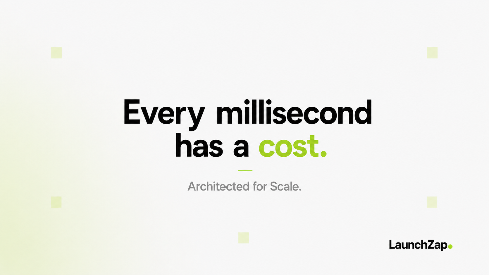
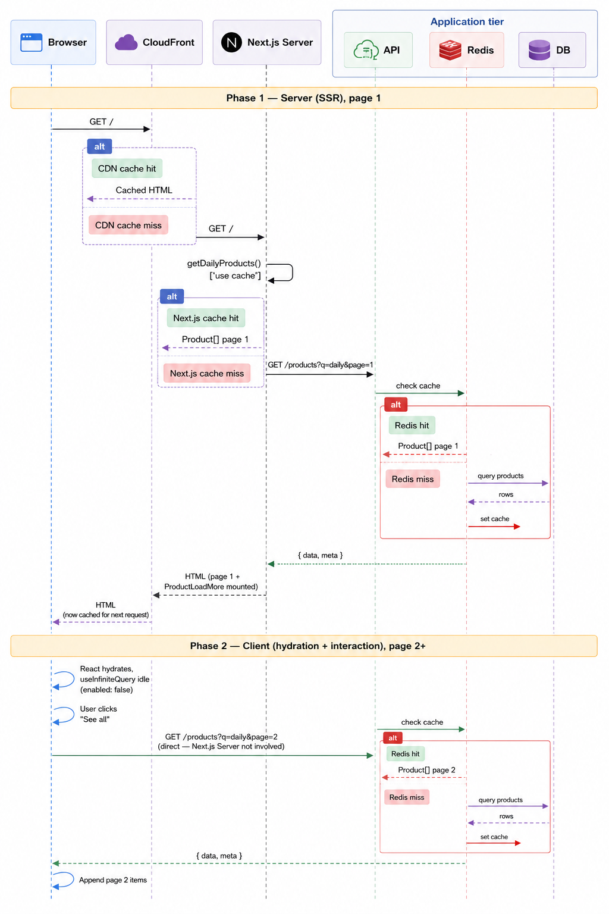

# LaunchZap

<p align="center">
  
</p>

> Scalability isn't a feature.
> It's an architectural decision.

LaunchZap wasn't built to prove that another SaaS product could be created.

It was built to answer a different question.

**What happens when architectural decisions become the bottleneck?**

Modern applications rarely fail because they can't implement features.

They fail because they weren't designed to remain fast, resilient, and maintainable as traffic grows.

LaunchZap is an engineering playground created to explore those architectural decisions before they become production problems.

Every non-trivial decision below has a full write-up: context, trade-offs, and the alternative that was rejected in [`architecture-decisions.md`](./architecture-decisions.md).

## What it actually is

A product launch & discovery platform - makers submit products, discoverers browse and vote across daily/weekly/new feeds. The product surface is deliberately small: a read-heavy public feed with a narrow write path (votes, submissions). That asymmetry is intentional - it's what justifies a real multi-layer caching strategy, and gives the write path just enough surface to demonstrate cache invalidation without turning voting into the product itself.

## Architecture & infrastructure

3-tier, each tier independently reasoned about, cached, and scaled:

```
 Browser
    │
    ▼
 CloudFront + S3            CDN, immutable asset caching
    │
    ▼
 ┌───────────────────────────────────────────────┐
 │ Presentation — Next.js 16 on ECS Fargate        │
 │ Server Components · Streaming SSR · use cache   │
 └────────────────────────┬────────────────────────┘
                           │ REST, Zod-validated
                           ▼
 ┌───────────────────────────────────────────────┐
 │ Application — Express 5 API on ECS Fargate      │
 │ Feature-based modules                           │
 └────────────────────────┬────────────────────────┘
                           │
             ┌─────────────┴─────────────┐
             ▼                           ▼
 ┌─────────────────────────┐ ┌─────────────────────────┐
 │ Aurora PostgreSQL         │ │ Redis — ElastiCache      │
 │ Serverless v2             │ │                          │
 └─────────────────────────┘ └─────────────────────────┘
```



3-AZ VPC, ALB in the public subnet, compute and data in private subnets, encrypted at rest and in transit, least-privilege security groups between tiers. All of it - VPC, ALB, ECS, CloudFront, RDS, ElastiCache, IAM, KMS, Lambda@Edge, Secrets Manager, X-Ray - is provisioned via Terraform in [`infra/`](./infra); common operations are wrapped in the [`Makefile`](./Makefile) (`make infra-plan`, `make infra-apply`, `make deploy`).


## Stack

| | |
|---|---|
| **Web** | Next.js 16 (App Router, Server Components, cache components) · React 19 · TypeScript · TanStack Query · Zod |
| **API** | Node.js · Express 5 · Prisma 7 · Zod · JWT |
| **Data** | PostgreSQL (Aurora Serverless v2 in prod) · Redis |
| **Infra** | Terraform · AWS (ECS Fargate, ALB, CloudFront, S3, RDS, ElastiCache, KMS, IAM, Lambda@Edge, X-Ray) · Docker |


## Techniques Used

### Web
* Hybrid SSR + client pagination
  * Initial page (page 1) server-rendered while subsequent pages from the 2nd page onward are managed by client `useInfiniteQuery` in order to achieve both SEO and dynamic data fetching.
* Utilized Next.js page rendering techniques (ISR + SSR + SSG) for better SEO using `generateStaticParams` + ISR for high-traffic pages.
* SSR prefetch (`HydrationBoundary` + parallel `prefetchQuery`) to remove the `/auth/me` → `/votes` waterfall on first paint
* Handle auth token rotation by splitting implementation across server actions (inline retry, directly set cookies) vs. server components (redirect via `proxy.ts`, since we cannot directly set cookies mid-stream).
* Used tag-scoped `cacheTag/revalidateTag` cache revalidation (e.g. `product-${id}`, not the whole `products` group) so frequent votes don't blow away the entire feed cache.
* Multi-instance Next.js cache handler backed by Redis, replacing the default in-memory cache (required because ECS runs multiple Fargate tasks and the default cache is per-instance).
* Implemented tiered `cacheLife` TTLs per feed (`minutes` for "new", `hours` for "daily", `days` for "weekly") - TTL matched to each feed's real mutation rate instead of one global cache duration.
* Every API response is parsed through Zod at the boundary, so schema drift fails can handle easily and ensure secure data shapes.

### API
* Validated all request input using Zod validation:
  * Implemented custom middleware to wrap every route: `req.validatedParams`, `req.validatedBody`, `req.validatedQuery` typed downstream, malformed input rejected before it reaches Prisma.
* Set up RDS IAM auth to access the DB instead of providing a static DB password for better security:
  * API accesses RDS via `@aws-sdk/rds-signer` (token cached and refreshed under its 15-minute AWS expiry, avoiding static DB passwords in environment variables).
* Centralized error middleware normalizing thrown errors, including malformed JSON bodies, into a consistent response shape.
* Load-tested with k6 (`tests/load/`) - ramping concurrency against read-only and read-write paths, checked against a p(95) latency threshold.

### Infra
* 3-AZ VPC: ALB in the public subnet, ECS + Aurora + Redis in private subnets.
* Tried to maximize least-privilege security groups per tier:
  * ALB accepts 80/443 from the internet.
  * ECS web only from ALB.
  * ECS API only from ALB + ECS web. 
  * Data tier (RDS Aurora, ElastiCache) only from ECS.
* Used RDS Proxy in front of Aurora:
  * To achieve connection pooling at scale and use IAM auth instead of distributing DB credentials to the API.
* CloudFront + S3 immutable caching (`max-age=31536000, immutable`) for UUID-named uploads: skips revalidation entirely instead of eating a 304 every load.
* Deployed using ECS Fargate for both web and API:
  * Stateless tasks, independently deployable and scalable, which is better for rapid scaling during traffic spikes.
* Single KMS CMK encrypting RDS, ElastiCache, and Secrets Manager at rest.
* Set up Secrets Manager for runtime secrets.
* Structured Terraform modules so that: (keeps environment state isolated and modules reusable.)
  * `environments/` (per-env state) 
  * `resources/` (reusable modules)
  * `global/` (account-level: ECR, IAM)
* X-Ray for cross-service tracing


## Running locally

```bash
cp apps/api/.env.example apps/api/.env
cp apps/web/.env.example apps/web/.env

docker compose up

# first run only
docker compose exec api pnpm prisma migrate dev
docker compose exec api pnpm prisma generate
```

- Web: http://localhost:3000
- API: http://localhost:4000/api

Local dev runs Dockerized PostgreSQL and Redis as stand-ins for Aurora and ElastiCache.

## Status

This is a running log, not a finished product; see [`todo.md`](./todo.md) for the current state.
